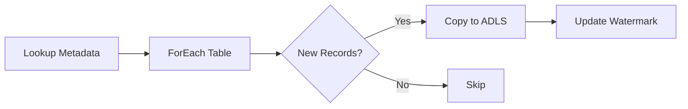

# ☁️ Azure Data Factory ETL/ELT Framework

### 🚀 On-Premise SQL Server to Azure Data Lake Storage Gen2 Migration

[](https://azure.microsoft.com/en-us/services/data-factory/)
[]()
[]()

---

## 📖 Table of Contents
- [Project Overview](#-project-overview)
- [Architecture](#-architecture)
- [Data Warehouse Model](#-data-warehouse-model)
- [Configuration](#-configuration)
- [Pipeline Logic](#-pipeline-logic)
- [Getting Started](#-getting-started)
- [Key Features](#-key-features)
- [Technologies Used](#-technologies-used)

---

## 🎯 Project Overview

Modern organizations generate massive volumes of operational data within on-premise systems. To unlock the power of scalable analytics and real-time reporting, this data must be efficiently migrated to the cloud.

This project delivers an **end-to-end data engineering pipeline** that:
- ✅ Extracts data from **On-Premise SQL Server**
- ✅ Processes it using **Azure Data Factory (ADF)**
- ✅ Stores transformed data in **Azure Data Lake Storage Gen2 (ADLS Gen2)**

The pipeline employs a **metadata-driven incremental loading strategy** using a watermark table, ensuring only new or updated records are processed — optimizing performance and reducing costs.

---

## 🏗️ Architecture


### Key Components:
- **Self-Hosted Integration Runtime (SHIR)** – Secure connectivity to on-premise data sources
- **Parameterized Pipelines** – Reusable, dynamic pipelines for full/incremental loads
- **Parquet Conversion** – Efficient columnar storage format for analytics
- **Watermark Table** – Tracks last processed records for incremental loads

---

## 📊 Data Warehouse Model

### Star Schema Design for Analytics

| Dimension Tables | Fact Tables |
|------------------|-------------|
| DimCustomer | FactSales |
| DimProduct | FactOrders |
| DimDate | FactPayments |
| DimRegion | FactReturns |
| DimStore | — |

> **Optimized for high-performance reporting and BI queries**

---

## ⚙️ Data Warehouse Configuration


---

## 🔁 ADF Pipeline Logic

The pipeline is designed for **scalability and reusability**:

1. **Lookup Activity** – Retrieves table metadata from control table
2. **ForEach Loop** – Dynamically iterates through all tables
3. **Condition Check** – Verifies if new records exist since last load
4. **Copy Activity** – Loads incremental data into ADLS Gen2 as Parquet files



---

## 🚀 Getting Started

### Prerequisites
- Azure Subscription
- On-Premise SQL Server instance
- Azure Data Factory instance
- Azure Data Lake Storage Gen2 account

### Setup Steps
1. **Clone this repository**
   ```bash
   git clone https://github.com/yourusername/adf-etl-framework.git
   ```

2. **Configure Self-Hosted IR**  
   Install and register SHIR on your on-premise server

3. **Deploy ADF Pipelines**  
   Import the ARM templates or JSON pipeline definitions

4. **Configure Linked Services**  
   Update connection strings and authentication methods

5. **Create Control Tables**  
   Run the provided SQL scripts to create metadata and watermark tables

6. **Execute & Monitor**  
   Trigger the pipeline and monitor in Azure Data Factory Studio

---

## ✨ Key Features

- 🔐 **Secure Hybrid Connectivity** – SHIR ensures encrypted communication
- 📦 **Parquet Output** – Optimized for query performance and compression
- 🧠 **Incremental Loading** – Reduces data movement and costs
- 🧩 **Parameterized Pipelines** – No hardcoded table names; easily scalable
- 📈 **Star Schema Ready** – Designed for analytics and BI tools
- 🔁 **Idempotent Design** – Safely rerun without duplicate data

---

## 🛠️ Technologies Used

| Category | Technology |
|----------|------------|
| **Cloud Platform** | Microsoft Azure |
| **ETL/ELT** | Azure Data Factory |
| **Storage** | Azure Data Lake Storage Gen2 |
| **Data Source** | SQL Server (On-Premise) |
| **Connectivity** | Self-Hosted Integration Runtime |
| **Data Format** | Parquet |
| **Modeling** | Star Schema |
| **Version Control** | Git & GitHub |

---

## 📌 Use Cases

- Cloud migration from legacy SQL Server environments
- Building a modern data lakehouse architecture
- Enabling advanced analytics and Power BI dashboards
- Reducing on-premise storage costs
- Implementing scalable, metadata-driven ETL/ELT processes

---

## 🤝 Contributing

Contributions are welcome! Please feel free to submit a Pull Request or open an Issue for any enhancements, bugs, or questions.

---

## 📄 License

This project is licensed under the MIT License - see the [LICENSE](LICENSE) file for details.

---

## 📧 Contact

**Author:** [Areef Shaik]  
**GitHub:** [@AreefShaik78](https://github.com/AreefShaik78)
**Project Link:** [@SQL-TO-ADLS-INGESTION](https://github.com/AreefShaik78/SQL-TO-ADLS-INGESTION)

---

⭐ **If this project helped you, don't forget to give it a star!** ⭐
